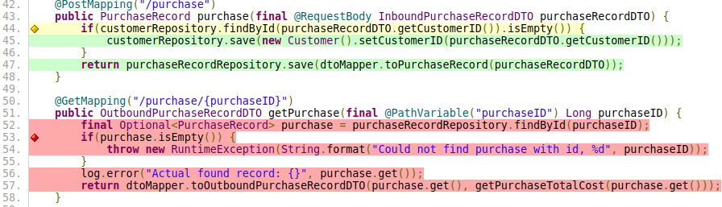
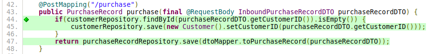

<h1>Writing Effective Unit Tests</h1>

If put into practice correctly, unit tests enable developers to proactively fix logic errors and teams to deliver the correct solution in a predictable and managed way. In this blog we'll discuss why unit tests are important and demonstrate techniques for writing them through a concrete example. Let's first define unit tests.

<blockquote> Unit tests are a specialized form of automated testing written by developers that verifies small isolated paths of logic work as intended by the developer. </blockquote>

<br>
Each unit test can be viewed simply as a developer "<a href="https://www.excella.com/insights/why-is-unit-testing-important">intention check</a>" which verifies that the unit of logic (usually a subroutine/function) is behaving as expected by the developer for a given scenario.
<br>

<b> Putting unit tests into practice correctly requires attention to each of the following areas:</b>
  - <b>Requirements Gathering:</b> Developers must take their due diligence to confirm their understanding of requirements for how the system should work in each scenario they are testing.
  - <b>Writing Clean and Testable Implementation:</b> Avoid modifying global state where possible; this makes code exceedingly difficult to test in isolation. See Misko Hevery's <a href="https://www.youtube.com/watch?v=RlfLCWKxHJ0"> Clean Code Talks</a>.
  - <b>Consistency:</b> Developers must consistently write unit tests and understand their importance.
  - <b>Simplicity:</b> Each test only covers one path through a logical unit in isolation.
  - <b>Meaningful:</b> Each test must verify code in a specific scenario behaves as expected.
  - <b>Wide-Ranging:</b> There needs to be enough tests to cover all possible success and failure scenarios.
  - <b>Readable:</b> The tests need to follow a consistent pattern that is easily understood by other developers.
  - <b>Automated:</b> The tests need to run periodically as new functionality is developed and released.

When teams put this practice into place correctly, something magic happens. Let's discuss an example.

<br>**Unit Tests Keep Code Stable**<br>
Say there are two developers, Martha and John, who are contracted to work on a customer facing application. Martha has worked on the project for several months and has implemented all of its functionality which is currently working in production. When her contract ends or she takes extended leave, John has to step in for her to continue where she left off. Assuming Martha had taken the time to unit test her code from every scenario, John may find himself breaking her tests at first. As he studies the failures one by one, he begins to understand not only Martha's intent but also subtle details, otherwise easily overlooked, which could make or break the system. As John learns and adjust his solutions as needed by the unit tests, he and his team can deploy their next release to production on time and with confidence that none of the pre-existing features will be broken.

<br>**Unit Tests Promote Self Revision**<br>
If John also makes the conscious effort of unit testing every scenario after his requirements gathering, he will find himself analyzing his logic from many different angles. As he thinks over the edge cases and how they will affect his logic, he will learn to expect the unexpected. This act of intentional self revision will enable him to root out design deficiencies, resolve logic errors, and find the simplest and most robust solutions. Assuming John's solutions pass user acceptance testing and meet requirements, his team can be extra confident that his work is robust and stable and will remain that way in future releases.

<br>**Unit Tests Are What Developers Put Into Them**<br>
The value of unit tests are purely what the developers put into them and it's important to point out that unit tests verify developer intent not system functionality. Can developers waste time and effort writing and testing code that wasn't even meeting specifications? Could a lot of money and time be wasted if unit tests aren't put into practice correctly? You bet, and sadly it probably happens more often than you think.  
<br>
To avoid common pitfalls of uneffective unit testing, the most important thing for developers to remember is to keep the big picture in mind and not to fear coming to their team lead with questions about the requirements. Secondly, developers must be educated enough to put unit tests into practice correctly. As long as developers follow those guidelines, their <b>intent</b> and thus unit tests should be valid. It is also essential for developers and test/delivery leads to keep in mind having the right balance of other techniques such as <a href="https://martinfowler.com/bliki/IntegrationTest.html"> integration tests </a> and <a href="https://www.softwaretestinghelp.com/what-is-end-to-end-testing/"> user acceptance tests </a> to help validate requirements.

<br>**Unit Testing Walkthrough**<br>
Now let's begin going over a concrete example of how unit tests can be put to use by developers. While this concrete example will involve walking through a Java project, the concepts will be explained such that the ideas can be translated to any other programming language. For more details about unit testing techniques I strongly recommend the book <a href="http://xunitpatterns.com/index.html">XUnit Test Patterns: Refactoring Test Code</a>. Since unit tests must trace back to requirements, lets start with listing out the requirements for our concrete example, a simple customer lookup API. Let's say that we have a retail store which wants to start auditing purchases and decides to hire your team to quickly roll out an API that must meet the below requirements for all new purchases.

<b>Below is the specification of what the API must support through its endpoints:</b>
  - Storage and retrieval of each customer purchase.
  - Retrieve full list of customers
  - Retrieve purchase history for a customer ranked by amount spent
  - Retrieve total amount spent by a customer.

The scenarios covered in this blog involve the implementation and unit tests for making a purchase.

```Java
@PostMapping("/purchase")
public PurchaseRecord purchase(final @RequestBody InboundPurchaseRecordDTO purchaseRecordDTO) {
  if(customerRepository.findById(purchaseRecordDTO.getCustomerID()).isEmpty()) {
      customerRepository.save(new Customer().setCustomerID(purchaseRecordDTO.getCustomerID()));
  }
  return purchaseRecordRepository.save(dtoMapper.toPurchaseRecord(purchaseRecordDTO));
}
```

To summarize, we have an endpoint that takes a customer purchase as input, saves that customer <i>if</i> it is their initial purchase, and then saves and returns back the purchase.

Note that in the above method, given the single <i>if</i> statement, there are two possible "happy path" branches to be tested: the successful initial purchase and the successful subsequent purchase. While in a real application we will want to also consider and test the failure scenarios by providing the possible invalid inputs, we will leave those out here for the sake of conciseness.

Let's start with the initial successful purchase scenario. When we look closely we notice that the function we are testing which we will call <a href="http://xunitpatterns.com/SUT.html">SUT</a> (System Under Test) really doesn't do much itself, it is mostly delegating responsibilities to its dependencies and passing inputs and outputs around to their functions. By delegating in this way, the implementation is leveraging the concept of software reuse and allows the code to be very concise and readable. In order to test such code in isolation, we need to think about how we are expecting it to interact with the dependencies it performs the delegation on. Lets break down what behavior is expected to happen when a customer makes a successful initial purchase:

<b>Expected Behavior</b>
  - <b>The correct input is provided to the SUT </b>
    - The method is provided with an object of type InboundPurchaseRecordDTO as an input (line 2).
  - <b>The customer is saved to the database:</b>
    - The CustomerRepository dependency's findById method takes the customer id from the InboundPurchaseRecordDTO input and returns an empty value (line 3).
    - The CustomerRepository save method saves the provided customer id into a table (line 4).
  - <b>The purchase is saved to the database</b>
    - The DtoMapper dependency's toPurchaseRecord method translates the input into a database object (line 6).
    - The database object is passed into the PurchaseRecordRepository save method and returned by it (also line 6).
  - <b>The correct output is provided by the SUT</b>
    - The function exits returning the output of the save method (also line 6).

We will refer back to the above behavior summary later as we cover the setup and verification steps of our unit test, but for now lets start with a high level overview of how these tests are written. For the unit tests we use the <a href="http://xunitpatterns.com/JUnit.html">JUnit Automated Test Framework </a> and follow the <a href="http://xunitpatterns.com/Creation%20Method.html#Anonymous%20Creation%20Method"> Fresh Fixture Setup Pattern </a> which involves re-initializing the SUT during the beginning of each individual test. This pattern is recommended because it prevents state changes from leaking from one test to another thus promoting predictable behavior between test runs, and promotes readability. Each test that is run has <a href="http://xunitpatterns.com/Four%20Phase%20Test.html">four phases</a>: setup, exercise, verify, and teardown.

Below is the full unit test that I wrote for the customer's initial purchase:

```Java
@Test
public void customerInitialPurchaseSuccessful() {
    /**
    * Setup
    */
    // stub the customer lookup to simulate non existing customer
    Mockito.when(customerRepository.findById(DefaultStoreValues.defaultCustomerID1)).thenReturn(Optional.empty());

    // create the expected customer to be saved
    final Customer expectedSavedCustomer = new Customer().setCustomerID(DefaultStoreValues.defaultCustomerID1);

    // stub the dto mapper operation return the expect result
    final PurchaseRecord expectedResult = Mockito.mock(PurchaseRecord.class);
    Mockito.when(dtoMapper.toPurchaseRecord(DefaultStoreValues.defaultInboundCustomerPurchase)).thenReturn(expectedResult);

    // stub the save operation to save successfully returning saved result
    Mockito.when(purchaseRecordRepository.save(expectedResult)).thenReturn(expectedResult);

    /**
     * Exercise
     */
    final PurchaseRecord actualResult = systemUnderTest.purchase(DefaultStoreValues.defaultInboundCustomerPurchase);

    /**
     * Verify
     */
    Mockito.verify(customerRepository, Mockito.times(1)).save(expectedSavedCustomer);
    Mockito.verify(customerRepository, Mockito.times(1)).findById(DefaultStoreValues.defaultCustomerID1);
    Mockito.verify(dtoMapper, Mockito.times(1)).toPurchaseRecord(DefaultStoreValues.defaultInboundCustomerPurchase);
    Mockito.verify(purchaseRecordRepository, Mockito.times(1)).save(expectedResult);
    Assertions.assertTrue(expectedResult == actualResult, "The returned result does not match the expected result");
}
```

Note that the method for the above unit test is named based on a concise description of the scenario we are testing (customerInitialPurchaseSuccessful). Above, the "Setup", "Exercise", and "Verify" sections of the code are denoted by their respective comments. Also note that the "Teardown" section is omitted in this case since the Java language includes a <a href="http://xunitpatterns.com/Garbage-Collected%20Teardown.html">garbage collector</a> which implicitly handles this step by removing all objects in the method as they go out of scope. Each step of the unit test aside from "Teardown" is covered below in more detail:

<br>**Setup**<br>
The setup section of a unit test is needed to (1) instantiate the SUT and (2) put in place the <a href="http://xunitpatterns.com/indirect%20input.html">indirect inputs</a>  necessary for the correct scenario to be exercised. We will first discuss the object instantiation then cover the indirect inputs. Since all tests will require the tested SUT's object instantiation, we have moved the logic into a function annotated with @BeforeEach which informs JUnit to run this function before each test. In this setup step we invoke the tested object's constructor by passing mocks of each dependency (line 8 below). These mock versions of the dependencies are created using the  <a href="https://site.mockito.org/">Mockito Framework</a> which helps us to create our indirect inputs and subsequently verify the correct behavior in our SUT.

```Java
@BeforeEach
public void setup() {
    purchaseRecordRepository = Mockito.mock(PurchaseRecordRepository.class);
    storeItemRepository = Mockito.mock(StoreItemRepository.class);
    customerRepository = Mockito.mock(CustomerRepository.class);
    dtoMapper = Mockito.mock(DtoMapper.class);

    systemUnderTest = new StoreInventoryController(purchaseRecordRepository,
            storeItemRepository, customerRepository, dtoMapper);

    DefaultStoreValues.initialize(storeItemRepository);
}
```

With the SUT instantiated as shown above, we are now in a position where we can test the initial purchase in isolation by stubbing the behaviors of the mocks as shown in the Setup section of the unit test below:

```Java
/**
* Setup
*/
// stub the customer lookup to simulate non existing customer
Mockito.when(customerRepository.findById(DefaultStoreValues.defaultCustomerID1)).thenReturn(Optional.empty());

// create the expected customer to be saved
final Customer expectedSavedCustomer = new Customer().setCustomerID(DefaultStoreValues.defaultCustomerID1);

// stub the dto mapper operation return the expect result
final PurchaseRecord expectedResult = Mockito.mock(PurchaseRecord.class);
Mockito.when(dtoMapper.toPurchaseRecord(DefaultStoreValues.defaultInboundCustomerPurchase)).thenReturn(expectedResult);

// stub the save operation to save successfully returning saved result
Mockito.when(purchaseRecordRepository.save(expectedResult)).thenReturn(expectedResult);
```
By manipulating the behavior of the dependency mocks as shown above we can set up our test to run through the correct branch in a controlled manner. For this example each indirect input is declared using the Mockito Framework's ".when()" and ".thenReturn()" statements, thus there are the following three declared in the code above.

<b>Indirect Inputs:</b>
  - <b>Enable the customer to be saved to our database </b>
    - Line 5: <i>When</i> the CustomerRepository dependency findByID method is provided with the customer id, <i>then</i> it returns an empty response as an indirect input to the SUT.
  - <b>Enable the purchase to be saved to our database</b>
    - Line 12: <i>When</i> the DtoMapper dependency's toPurchaseRecord() method is given the purchase input, <i>then</i> it returns back the database record as an indirect input to the SUT.
  - <b>Enable the SUT to return the database record</b>
    - Line 15: <i>When</i> the PurchaseRecordRepository save method is given the database record, <i>then</i> the database record is returned back as an indirect input to the SUT.

Now let's cover what happens when the tested method is exercised with these indirect inputs in place.

<h4>Exercise</h4>

Now, when the purchase method is exercised as shown below,

```Java
/**
 * Exercise
 */
final PurchaseRecord actualResult = systemUnderTest.purchase(DefaultStoreValues.defaultInboundCustomerPurchase);
```

we can verify that the correct path of code was executed or not. We can do so by running the test and leveraging our <a href="https://docs.gradle.org/current/userguide/jacoco_plugin.html">code coverage tool</a> whose output is illustrated below.



Notice that the path we are executing in our test is green, the yellow shows that only 1 of 2 branches in the if statement have been run so far, the red shows paths that have not been tested.

<br>**Verify:**<br>
While the code coverage tool does confirm that the code path of the scenario is run, it cannot confirm the <b>Expected Behavior</b> defined above actually occurred. As mentioned previously there is not a lot the code we are testing does, it is only delegating the responsibilities of database storage/retrieval and translation to its dependencies. The purpose of the verification step is to ensure that the SUT performed this delegation correctly and provided the expected outcomes. The purpose of the verification section of the unit test is to ensure that, when exercised with the indirect inputs specified during setup, the SUT will behave as expected. In this case, what we need to verify is that (1) the customer record is saved (2) the purchase record is saved (3) the saved purchase is returned by the SUT. Using the Mockito "verify" method we ensure all of the behavior occurred as expected as demonstrated below:

```Java
/**
* Verify
*/
Mockito.verify(customerRepository, Mockito.times(1)).save(expectedSavedCustomer);
Mockito.verify(customerRepository, Mockito.times(1)).findById(DefaultStoreValues.defaultCustomerID1);
Mockito.verify(dtoMapper, Mockito.times(1)).toPurchaseRecord(DefaultStoreValues.defaultInboundCustomerPurchase);
Mockito.verify(purchaseRecordRepository, Mockito.times(1)).save(expectedResult);
Assertions.assertTrue(expectedResult == actualResult, "The returned result does not match the expected result");
```

Since, as mentioned earlier, the SUT just passes this object around we don't need to verify the contents of the result in this test. However, we do need to verify that the method delegated responsibilities correctly as seen in the above code.

<b>We can summarize the above code as follows:</b>
  - <b>The customer is saved</b>
    - Line 4: Make sure the SUT called the <i>CustomerRepository</i> object's <i>save</i> method <i>once</i> and provided the correct object (Mockito verifies arguments with a deep equality check).
    - Line 5: Make sure the SUT attempted to look up the customer using the <i>CustomerRepository</i> object's <i>findById</i> method <i>once</i> and was provided with the correct id.
  - <b>The purchase is saved</b>
    - Line 6: Make sure that the SUT delegated the translation of the purchase from input to database format correctly by using the <i>DtoMapper</i> object's <i>toPurchaseRecord</i> method <i>once</i> and provided the correct purchase input as an argument.
    - Line 7: Make sure the SUT took the translated purchase record and saved it to the database by calling the <i>PurchaseRecordRepository</i> object's <i>save</i> method <i>once</i> and providing the correct purchase record as the argument
  - <b>The saved purchase is returned by the SUT</b>
    - Line 8: Using the JUnit <i>assertTrue</i> method make sure correct argument was returned by using a shallow equality check (shallow since contents of what is returned relies on the dependencies which are not tested here).

<br>**Testing Subsequent Purchase Scenario**<br>
Testing the second scenario, successful subsequent purchase, only requires some slight alterations to the previous test. Namely, the CustomerRepository findById() method must now return a non-empty record and we must verify that the customer record is now not saved as shown below:

```Java
@Test
public void customerSubsequentPurchaseSuccessful() {
    /**
     * Setup
     */
    // stub the customer lookup to simulate existing customer
    Mockito.when(customerRepository.findById(DefaultStoreValues.defaultCustomerID1)).thenReturn(Optional.of(DefaultStoreValues.defaultCustomer));

    // stub the dto mapper operation to return the expected result
    final PurchaseRecord expectedResult = Mockito.mock(PurchaseRecord.class);
    Mockito.when(dtoMapper.toPurchaseRecord(DefaultStoreValues.defaultInboundCustomerPurchase)).thenReturn(expectedResult);

    // stub the save operation to save successfully returning the saved result
    Mockito.when(purchaseRecordRepository.save(expectedResult)).thenReturn(expectedResult);

    /**
     * Exercise
     */
    final PurchaseRecord actualResult = systemUnderTest.purchase(DefaultStoreValues.defaultInboundCustomerPurchase);

    /**
     * Verify
     */
    Assertions.assertTrue(expectedResult == actualResult, "The returned result does not match the expected result");
    Mockito.verify(purchaseRecordRepository, Mockito.times(1)).save(expectedResult);
    Mockito.verify(customerRepository, Mockito.times(1)).findById(DefaultStoreValues.defaultCustomerID1);
    Mockito.verify(dtoMapper, Mockito.times(1)).toPurchaseRecord(DefaultStoreValues.defaultInboundCustomerPurchase);
    Mockito.verify(customerRepository, Mockito.never()).save(Mockito.any());
}
```

Now when we run the test, the code coverage tool reveals that we have completely covered all paths of this function as shown below:



We can make sure the verification is correct in both of these scenarios by purposefully breaking some of the functionality in the implementation and ensuring the unit test now breaks where it didn't before. These tests will not only help us verify our code works as expected during development to resolve bugs early, but they may also prevent future developers from modifying this expected behavior later on without first thinking more in depth about the impacts to the current features.

<br>**Conclusion:**<br>
In this blog we've discussed the importance, positive outcomes, and potential pitfalls of unit testing and demonstrated techniques teams can use for writing effective unit tests through a concrete example. Let's review some important takeaways.
<br><br>

  - <b>Unit tests only verify developer intent:</b> While unit tests are useful, requirements must be verified with other forms of testing (e.g. functional and performance tests).
  - <b>Training is key:</b> Teams need developers with the education and discipline needed to consistently write effective unit tests.
  - <b>Requirements Gathering:</b> Developers must gather requirements early on and throughout development to ensure they are on the right track in their code and tests, otherwise the tests and code may be a waste of time and effort.

In conclusion, teams who write effective unit tests will see more robust and self revised code being released as well as a boost in predictable and consistent behavior between releases regardless of staffing changes.

<br>**Feedback and Suggestions:**<br>
One of the positive outcomes for the developers who write unit tests effectively is that the process often reveals simpler and better solutions. Has writing unit tests ever changed your view of a challenging problem? Have unit tests helped keep your team in line with its goals? Have you experienced one of the pitfalls of uneffective unit testing practices? Let us know your thoughts in the comments section. For the complete source code of the above example project, visit the <a href="https://github.com/jrbruce86/singlestone-unittest-blog">github</a> page.
